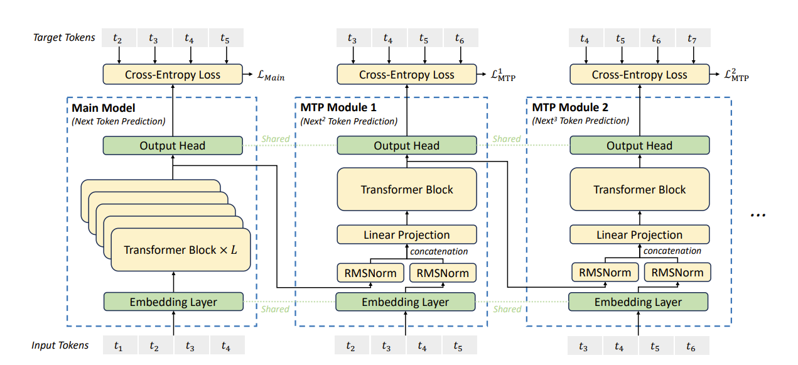
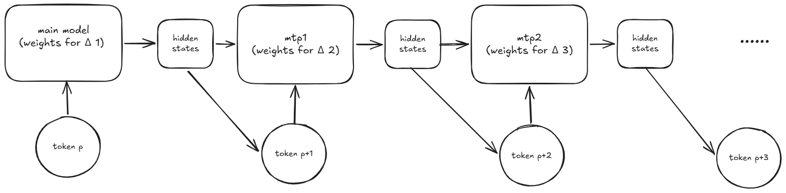
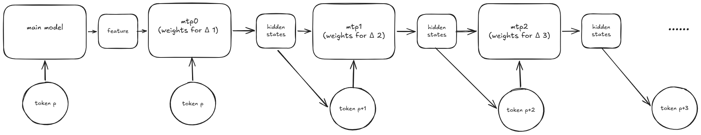
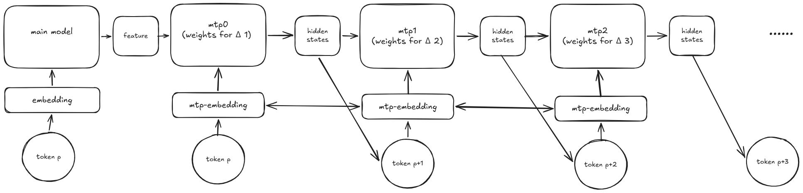
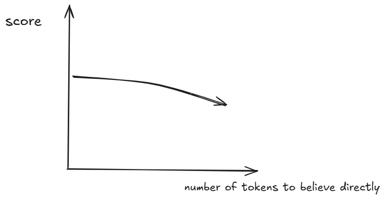

# Feature for multi tokens Prediction
## Background
Decode only 架构的 LLM（如 GPT、LLaMA 系列），推理时采用自回归（autoregressive）方式：每步只输入一个 token，模型基于已生成的全部 token 预测下一个 token。具体做法是：

1. **逐 token 生成**：将 prompt 输入模型，得到第一个输出 token；然后将该 token 拼接到输入末尾，再预测下一个 token，如此反复。
2. **KV Cache**：为了避免每步重复计算前面 token 的 Key 和 Value，推理时会维护一个 KV 缓存。每步只计算当前 token 的 K/V，追加到缓存中，后续注意力层直接从缓存读取完整序列的 K/V。
3. **单步推理延迟**：每步生成一个 token，因此总生成时间 = 单步推理延迟 × 输出 token 数。单步推理的时延主要来自注意力计算和 FFN 计算。

这种逐 token 串行生成的方式在输出长序列时效率较低，因此衍生出 speculative decoding 等加速方法。
Medusa、EAGLE 和 MTP 同属多 token 预测推理加速方案，但它们的核心设计理念和适用场景截然不同。

### MTP

多 token 预测推理加速方案的核心思想是 "**猜 — 并行验证**"（Draft & Verify）：由一个快速草稿模块一次性生成多个未来候选 token，再由目标大模型在单次前向传播中对这些候选 token 进行并行验证，从而将原本需要 K 步自回归生成的过程压缩为 1 步，显著降低每 token 的平均推理延迟。

**MTP：训练阶段的未来感知多 token 预测**

与前两者不同，MTP（Multi-Token Prediction）首先是一种**训练目标设计**，而非单纯的推理加速插件。它由 DeepSeek-V3 技术报告系统化引入并推广，通过在预训练阶段让模型在每个位置上同时预测多个未来 token（t+1、t+2……t+n），使 hidden state 必须编码更长远的信息，从而提升模型的数据效率和表征质量。

在架构层面，MTP 在共享的主干 Transformer 之上附加多个预测头（或 MTP Module），每个对应一个未来偏移位置。训练时采用链式 Teacher Forcing：第 k 个头的输入依赖于前 k-1 个头的**真实 token（Ground Truth）** ，形成训练阶段的序列依赖，损失函数为主损失与各层 MTP 损失的加权求和：total_loss = main_loss + (avg_mtp_loss × scaling_factor)。推理阶段可以将 MTP 模块**复用为内置草稿路径**，与主模型构成自推测解码（Self-Speculative Decoding），无需外部草稿模型即可实现推理加速。

MTP 的核心优势在于**训练即获得双重收益**：一方面通过更密集的训练信号提升模型本身的预测质量（已在 DeepSeek-V3、Qwen3-Next、Nemotron 3 Super 等模型中验证），另一方面可复用于推理加速，无需额外部署草稿模型。训练开销极小。

## Feature for multi tokens prediction
但是， mtp 这一方案是基于预测下一个 token 的模型。尽管 mtp 的接受率远高于 medusa、eagle 等其他方案，在特定的case（coding）中使用3层MTP，可以达到 3.6+ 的平均接收长度。但是这并没有解决笔者的疑问：

**有没有可能同时预测多个token，确定性地预测多个token？**

或者这么问：

**大模型能否预测未来m个token的feature，然后再通过一个结构，将其解码为m个token？**
### multi tokens
如果能确定地同时预测 m 个 token，同时生成 k 个 draft token，这能否来支撑一个 tpot 更小的模型？或者说，在相同的 tpot 下，支撑一个规模更大的模型？
### fmtp

重新审视 mtp 的架构：

对于一次 decode，输入的是 token $t_p$, 经过 embedding 得到 $e_p$，经过 main model 得到 $h_p$, $h_p$ 输入给 lm head，得到 $prob_p$, sample 得到 token $t_{p+1}$, 然后这个 token 得到 $e_{p+1}$ 和$h_p$ 作为 $mtp_1$ 的输入，得到 $h_p^1$，可以得到 $t_{p+2}$。

换而言之，我们可以把一次 decode 视为一个 per postion，都有不同权重的 RNN：

很容易注意到，如果把一次decode视为一个rnn的执行，main model的权重太大了，远大于后续用于生成其他 token 的权重。换句话说，这个流程下，预测的 p+1 的 token 应该比 p+2 的 token 更准确，这也是我们进行 speculative decode 时，总是以 main model 的概率为准的核心原因。

我们从一个实验中也可以看到这一点，实验设置如下
- 数据集：以一个 RL 数据集 ([a-m-team/AM-DeepSeek-Distilled-40M](https://huggingface.co/datasets/a-m-team/AM-DeepSeek-Distilled-40M)) 为主构造的训练集（合计约100B token+）上。
- 模型结构：Qwen3-4B 的结构为主干，lm head 和 embedding 权重独立，7层 mtp
- 训练设置：mtp scale设置为 $0.1$ (TODO 7)
- version of Megatron: core_r0.14.0

经过2048步后，可以看到：

lm loss: 1.075361E+00 | mtp_1 loss: 1.464631E+00 | mtp_2 loss: 1.522981E+00 | mtp_3 loss: 1.534986E+00 | mtp_4 loss: 1.549159E+00 | mtp_5 loss: 1.557763E+00 | mtp_6 loss: 1.550024E+00 | mtp_7 loss: 1.548013E+00

经过 16384 步后：

lm loss: 6.860194E-01 | mtp_1 loss: 9.684212E-01 | mtp_2 loss: 1.020181E+00 | mtp_3 loss: 1.040076E+00 | mtp_4 loss: 1.055723E+00 | mtp_5 loss: 1.066478E+00 | mtp_6 loss: 1.069652E+00 | mtp_7 loss: 1.073924E+00 

可以注意到，mtp 的几个 loss 随 position 上升，但是差较小，远小于 lm loss 和 mtp1 loss 的差。这是否意味着，如果预测的下一个 token 的结构和后续的 mtp 层保持一致，就可能可以得到一个逐 position 的 loss 差异更小的解码模块：

很容易注意到 mtp 和 main model 共享 embedding 层，这也就意味着 postion p 上的 token 对应相同的 embedding 输入给整个模型两次，所以，是否 mtp 层使用独立的 embeding更合适？

总之，我选择了 mtp 层共用一个和 main model 不同的 embedding。

2048步后的loss为：

| lm loss: 1.315205E+00 | pos_0 loss: 1.151194E+00 | pos_1 loss: 1.214942E+00 | pos_2 loss: 1.274871E+00 | pos_3 loss: 1.319556E+00 | pos_4 loss: 1.353432E+00 | pos_5 loss: 1.379951E+00 | pos_6 loss: 1.403515E+00 | pos_7 loss: 1.424574E+00 

However, it is easy to notice that this compare is unfair：
1. fmtp 的 lm loss 是 8 个 position 上的 loss 的均值。
2. original mtp 的 loss，lm loss(对应 fmtp 的 pos 0 的 loss)，mtp scale 默认为 0.1，因此每层的系数为 $1/70$

因此，我们还需要两个实验：
1. fmtp 的 lm loss 为 8 个 position 的 loss 和。
2. original mtp 设置 mtp scale 为 7

当然，original mtp 设置 mtp scale 为 7 后，lm loss 和 mtp 0 loss 的差异仍显著大于 fmtp 的 pos 0 loss 和 pos 1 loss 的差值，也可以证明 fmtp 可能确实可以支持得到一个能同时预测接下来 m 个 token 的模型。

### 补充实验：mtp scale设置为7
2048步后 ：lm loss: 1.146713E+00 | mtp_1 loss: 1.207833E+00 | mtp_2 loss: 1.271364E+00 | mtp_3 loss: 1.315093E+00 | mtp_4 loss: 1.349463E+00 | mtp_5 loss: 1.375947E+00 | mtp_6 loss: 1.398373E+00 | mtp_7 loss: 1.413271E+00

OK，构想破产，之前巨大的loss差异的核心原因就是过小的 mtp scale

### how to use fmtp in inference

从训练 loss 可以看到，fmtp 逐 position 的 loss 不断上升，一般而言，可以认为，只相信 pos 0 的推理的结果的模型表现的能力，会比直接相信 pos 0、1 的推理的结果的模型有更高的能力。以此类推，我们实际上得到了一个能力逐步下降的 n 个模型（n 为训练时使用的 mtp 层数）：
1. model 0 : only believe pos 0
2. model 1 : believe pos 0 / 1
3. ...

对于model i，剩下的 (n - 1 - i) 个 token 可以作为这个模型的 draft token。这就意味着，一个推理服务，可以同时支持 n 个级别的模型服务！而且，我们可以随时切换使用的推理质量的级别。

### some other problems

1. scaling law：到目前为止的 scaling law 其实讨论的是 next-1-token model 的 loss 和规模、数据量的关系。那么，next-n-tokens model 的 scaling law 是否会有改变？对于一个规模的模型，训练时同时拟合多少个token，可以不损害 model 0 的能力？
2. cost: 没有理由相信，n-tokens model 可以在同规模下达到 next-1-token model 的能力。那么当达到相近能力后，next-n-tokens model 是否真的能在推理上比有 mtp 支持的 1-tokens model 有更低的成本？

## something useless
